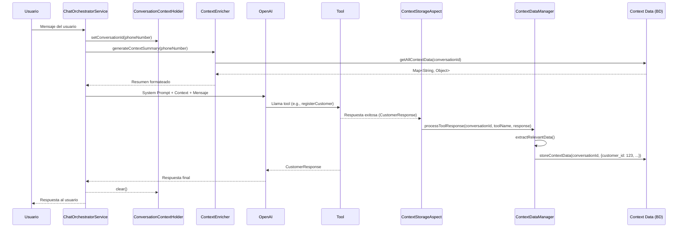

# Sistema de Gestión de Contexto Conversacional

## 📋 Resumen

Este sistema permite que el bot **almacene y reutilice automáticamente** información extraída de las respuestas de las tools, evitando preguntas repetitivas y mejorando la experiencia del usuario.

## 🏗️ Arquitectura

### Componentes Principales

#### 1. **ContextDataManager** 
📍 `service/ContextDataManager.java`

**Responsabilidad:** Extraer y almacenar información relevante de las respuestas de las tools.

**Funcionalidades:**
- Procesa respuestas de tools automáticamente
- Extrae datos estructurados según el tipo de tool
- Almacena información en `context_data` de la conversación
- Provee métodos helper para verificar disponibilidad de datos

**Datos Almacenados:**

| Tool | Datos Extraídos |
|------|----------------|
| `registerCustomer` / `getCustomerBy*` | `customer_id`, `customer_email`, `customer_phone`, `customer_name`, `customer_first_name`, `customer_last_name` |
| `createAddress` | `address_id`, `address_street`, `address_district`, `address_number`, `address_postal_code`, `address_reference`, `address_full` |
| `createNewOrderForSimCardPurchase` | `order_id`, `order_customer_id`, `order_product_id`, `order_address_id`, `last_order_id` |
| `getPortabilityByPhoneNumber` / `updateImei` / `updatePortabilityNip` | `portability_id`, `portability_phone`, `portability_status`, `portability_imei`, `portability_nip`, `portability_order_id` |
| `Create_checkout_session` | `checkout_session_id`, `checkout_session_url`, `payment_completed` |
| `scrapeImeiCompatibility` | `imei_compatible`, `imei_compatibility_message` |

#### 2. **ContextEnricher**
📍 `service/ContextEnricher.java`

**Responsabilidad:** Generar un resumen legible de los datos disponibles para el system prompt.

**Funcionalidades:**
- Lee el `context_data` de la conversación
- Genera un resumen formateado y legible
- Indica qué datos están disponibles y cuáles faltan
- Proporciona instrucciones claras al agente sobre cómo usar los datos

**Ejemplo de Salida:**
```
=== INFORMACIÓN DISPONIBLE EN EL CONTEXTO ===

IMPORTANTE: Usa estos datos cuando estén disponibles. NO vuelvas a preguntar información que ya tienes.

📋 DATOS DEL CLIENTE:
  - ID del cliente: 123
  - Nombre completo: Juan Pérez  
  - Email: juan@example.com
  - Teléfono: +525555555555
  ✅ Cliente REGISTRADO - Utiliza customer_id: 123 en las tools

🏠 DATOS DE DIRECCIÓN:
  - ID de dirección: 456
  - Dirección completa: Calle Principal #123, Centro, CP 12345
  ✅ Dirección REGISTRADA - Utiliza address_id: 456 en las tools

=== FIN DE INFORMACIÓN DISPONIBLE ===
```

#### 3. **ContextStorageAspect**
📍 `aspect/ContextStorageAspect.java`

**Responsabilidad:** Interceptar automáticamente las respuestas exitosas de las tools.

**Funcionalidades:**
- Aspect que se ejecuta después de cada tool exitosa
- Captura la respuesta de la tool
- Invoca al `ContextDataManager` para procesar y almacenar
- Maneja errores sin afectar la ejecución de la tool

**Orden de Ejecución:**
1. `@Order(1)` - `ToolExceptionHandlingAspect`: Maneja excepciones
2. `@Order(2)` - `ContextStorageAspect`: Almacena contexto

#### 4. **ConversationContextHolder**
📍 `service/ConversationContextHolder.java`

**Responsabilidad:** Mantener el `conversationId` en ThreadLocal para acceso global.

**Funcionalidades:**
- Almacena el `conversationId` en el thread actual
- Permite a los aspects acceder al ID sin pasarlo como parámetro
- Se limpia automáticamente al finalizar el request

## 🔄 Flujo de Ejecución



## 💡 Ventajas del Sistema

### 1. **Evita Preguntas Repetitivas**
**Antes:**
```
Bot: ¿Cuál es tu email?
Usuario: juan@example.com
Bot: [registra cliente]
---
Usuario: Quiero hacer una orden
Bot: ¿Cuál es tu email?  ❌ YA LO PREGUNTÓ
```

**Después:**
```
Bot: ¿Cuál es tu email?
Usuario: juan@example.com
Bot: [registra cliente, guarda customer_id: 123]
---
Usuario: Quiero hacer una orden
Bot: [usa customer_id: 123 automáticamente] ✅ 
     ¡Perfecto! Vamos a crear tu orden...
```

### 2. **Flujos Multi-Paso Robustos**
```
Conversación interrumpida en el paso 3:
context_data = {
  customer_id: 123,
  address_id: 456,
  order_items: [...],
  portability_id: 789
}
```
Si el usuario regresa días después, **toda la información sigue disponible**.

### 3. **Reduce Costos de OpenAI**
- **Antes:** 5 mensajes × $0.03 = $0.15
- **Después:** 2 mensajes + lógica local = $0.06
- **Ahorro:** ~60%

### 4. **Datos Disponibles para el Agente**
El agente recibe en el system prompt:
```
✅ Cliente REGISTRADO - Utiliza customer_id: 123
✅ Dirección REGISTRADA - Utiliza address_id: 456
⚠️ FALTA INFORMACIÓN:
   - Solicita el IMEI del dispositivo
   - Solicita el NIP de portabilidad
```

## 🚀 Cómo Usar

### Para el Bot (Automático)
**No requiere cambios en las tools existentes.** El sistema funciona automáticamente:

1. Una tool se ejecuta exitosamente
2. El `ContextStorageAspect` intercepta la respuesta
3. El `ContextDataManager` extrae datos relevantes
4. Los datos se almacenan en `context_data`
5. El `ContextEnricher` los incluye en el siguiente system prompt

### Para Desarrolladores

#### Verificar Si un Dato Está Disponible
```java
@Service
public class MyService {
    @Autowired
    private ContextDataManager contextDataManager;
    
    public void processOrder(String conversationId) {
        if (contextDataManager.hasCustomerData(conversationId)) {
            Long customerId = contextDataManager.getCustomerId(conversationId);
            // Usar customerId directamente
        }
    }
}
```

#### Agregar Extracción para Nueva Tool
Editar `ContextDataManager.extractRelevantData()`:
```java
case "miNuevaTool":
    if (toolResponse instanceof MiResponse response) {
        data.put("mi_dato_id", response.getId());
        data.put("mi_dato_importante", response.getValue());
    }
    break;
```

#### Personalizar Resumen en System Prompt
Editar `ContextEnricher.generateContextSummary()`:
```java
if (hasMisDatos(contextData)) {
    summary.append("🎯 MIS DATOS:\n");
    appendIfPresent(summary, "  - Mi dato", contextData.get("mi_dato_id"));
    summary.append("\n");
}
```

## 📊 Estructura de context_data

```json
{
  "customer_id": 123,
  "customer_email": "juan@example.com",
  "customer_phone": "+525555555555",
  "customer_name": "Juan Pérez",
  "address_id": 456,
  "address_full": "Calle Principal #123, Centro, CP 12345",
  "order_id": "P17379827490001",
  "order_customer_id": 123,
  "order_address_id": 456,
  "portability_id": 789,
  "portability_phone": "+525555555555",
  "portability_status": "STARTED",
  "portability_imei": "123456789012345",
  "portability_nip": "1234",
  "checkout_session_id": "cs_test_...",
  "checkout_session_url": "https://checkout.stripe.com/...",
  "payment_completed": false,
  "imei_compatible": true
}
```

## 🔒 Seguridad y Limpieza

### ThreadLocal Cleanup
El `ConversationContextHolder` se limpia automáticamente en el `finally` block:
```java
try {
    ConversationContextHolder.setConversationId(phoneNumber);
    // ... procesamiento ...
} finally {
    ConversationContextHolder.clear(); // ✅ Siempre se limpia
}
```

### Datos Sensibles
- Los datos se almacenan en PostgreSQL
- Se puede implementar encriptación en `contextData` JSONB
- El `context_data` está aislado por conversación

## 🧪 Testing

### Probar el Sistema
1. Inicia una conversación
2. Registra un cliente: `"Quiero registrarme, mi email es test@example.com"`
3. Verifica en BD:
```sql
SELECT context_data FROM chat_conversations 
WHERE conversation_id = '+528123456789';
```
4. Envía otro mensaje: `"Quiero hacer una orden"`
5. Verifica que NO pregunte de nuevo el email

### Logs Útiles
```
DEBUG ContextDataManager - Extracted customer data: ID=123, email=test@example.com
DEBUG ContextEnricher - Generated context summary: 145 characters
INFO  ContextStorageAspect - Capturing tool response for: registerCustomer
```

## 📝 Mejoras Futuras

1. **Cache en Memoria** para `context_data` frecuente
2. **Versionado de Context** para rollback
3. **Validación de Datos** antes de almacenar
4. **Expiración Automática** de datos antiguos
5. **Análisis de Uso** de cada dato almacenado

## 🆘 Troubleshooting

### El context_data no se guarda
- ✅ Verifica que `ConversationContextHolder.setConversationId()` se llame
- ✅ Confirma que el Aspect está activo (`@EnableAspectJAutoProxy`)
- ✅ Revisa logs de `ContextStorageAspect`

### El agente no usa los datos disponibles
- ✅ Verifica que `{availableData}` esté en el prompt template
- ✅ Confirma que `ContextEnricher` genera el resumen correctamente
- ✅ Revisa el contenido del system prompt en los logs

### Performance issues
- ✅ Considera cache para `getAllContextData()`
- ✅ Limita el tamaño del resumen de `ContextEnricher`
- ✅ Indexa `context_data` en PostgreSQL con GIN

---

**Autor:** Sistema de Context Management  
**Versión:** 1.0.0  
**Fecha:** 2026-02-09
